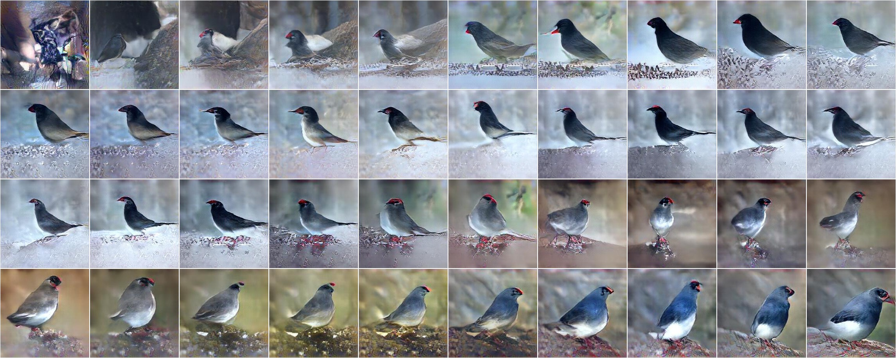
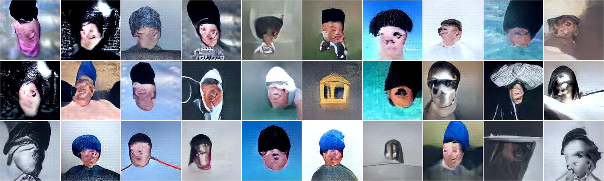
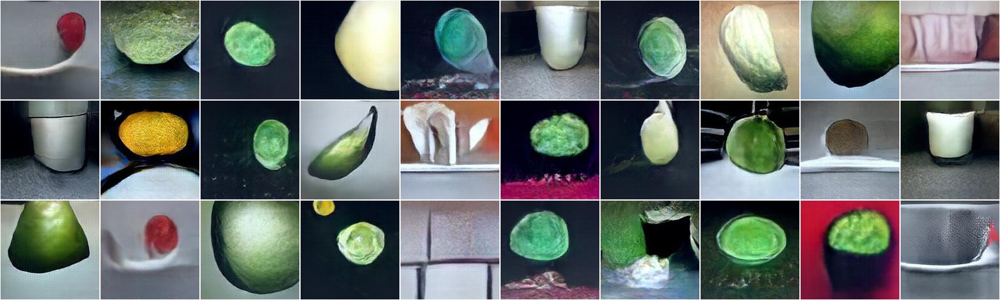
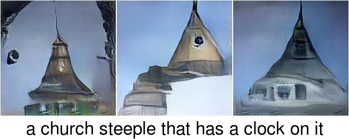
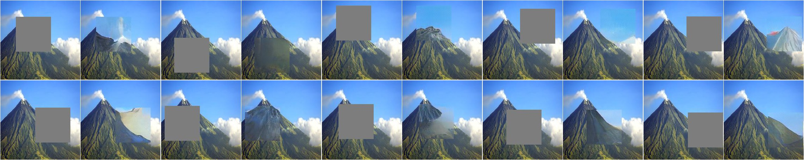

## Plug and Play Generative Networks

This repository contains source code necessary to reproduce some of the main results in the paper:

[Nguyen A](http://anhnguyen.me), [Yosinski J](http://yosinski.com/), [Bengio Y](http://www-labs.iro.umontreal.ca/~bengioy/yoshua_en/), [Dosovitskiy A](http://lmb.informatik.uni-freiburg.de/people/dosovits/), [Clune J](http://jeffclune.com). (2016). ["Plug & Play Generative Networks: Conditional Iterative Generation of Images in Latent Space"](http://arxiv.org/abs/1612.00005v1). arXiv:1612.00005v1.

**If you use this software in an academic article, please consider citing:**

    @article{nguyen2016ppgn,
      title={Plug & Play Generative Networks: Conditional Iterative Generation of Images in Latent Space},
      author={Nguyen, Anh and Yosinski, Jason and Bengio, Yoshua and Dosovitskiy, Alexey and Clune, Jeff},
      journal={arXiv preprint 1612.00005},
      year={2016}
    }

For more information regarding the paper, please visit www.evolvingai.org/ppgn

## 1. Setup

### Installing software
This code is built on top of Caffe. You'll need to install the following:
* Install Caffe; follow the official [installation instructions](http://caffe.berkeleyvision.org/installation.html).
* Build the Python bindings for Caffe
 * If you want to try example 5 (image captioning), you would need to use the Caffe provided [here](https://github.com/anguyen8/caffe_lrcn) instead
* You can optionally build Caffe with the GPU option to make it run faster (recommended)
* Make sure the path to your `caffe/python` folder in [settings.py](settings.py#L2) is correct
* Install [ImageMagick](http://www.imagemagick.org/script/binary-releases.php) command-line interface on your system (for post-processing the images)

### Downloading models
You will need to download a few models to run the examples below. There are `download.sh` scripts provided for your convenience.
* The generator network (Noiseless Joint PPGN-h) can be downloaded via: `cd nets/generator/noiseless && ./download.sh`
* The encoder network (here [BVLC reference CaffeNet](https://github.com/BVLC/caffe/tree/master/models/bvlc_reference_caffenet)): 
`cd nets/caffenet && ./download.sh`
* For example 4, download [AlexNet CNN trained on MIT Places dataset](http://places.csail.mit.edu/): `cd nets/placesCNN && ./download.sh`
* For example 5, download [LRCN image captioning model](http://jeffdonahue.com/lrcn): `cd nets/lrcn && ./download.sh`

Settings:
* Paths to the downloaded models are in [settings.py](settings.py). They are relative and should work if the `download.sh` scripts run correctly.

## 2. Usage
The main sampling algorithm is in [sampler.py](sampler.py). We provide two Python scripts for sampling [conditioned on classes](sampling_class.py) and sampling [conditioned on captions](sampling_caption.py) to which you can pass various command-line arguments to run different experiments. The basic idea is to sample from the joint model p(x,y) which decomposes into a prior p(x) model (given by the G and E) and a condition p(y|x) model. Here, we provide the pre-trained networks for the Noiseless Joint PPGN-h model (Sec 3.5 in the paper). We show examples conditioning on classes, hidden neurons, and captions by using different condition networks.

    

### Examples
We provide here 5 different examples as a starting point. Feel free to fork away to produce even cooler results!

[1_class_conditional_sampling.sh](1_class_conditional_sampling.sh): 
Sampling conditioning on the class "junco" (output unit #13 of the [CaffeNet DNN](https://github.com/BVLC/caffe/tree/master/models/bvlc_reference_caffenet) trained on ImageNet dataset). This script produces a sampling chain for a single given class.
* Running `./1_class_conditional_sampling.sh 13` produces this result:

    

<i>A sampling chain conditioning on class "junco" starting from a random code (top left)</i>

[2_class_conditional_sampling_many.sh](2_class_conditional_sampling_many.sh): We can also run a long sampling chain between different classes.
* Running `./2_class_conditional_sampling_many.sh <epsilon1>` with different `epsilon1` (multiplier for the image prior component) produces a chain with different styles of samples:

| 1e-5      | 1e-3   | 1e-1   | 
|:-------------:|:-------------:|:-------------:|
|   |  |  |
|   Default  |  More abstract style  |  Ignoring class gradient  |

[3_hidden_conditional_sampling.sh](3_hidden_conditional_sampling.sh): Instead of conditioning on a class, it is possible to condition on a *hidden* neuron i.e. performing <a href="http://www.evolvingai.org/mfv" target="_blank">Multifaceted Feature Visualization</a> or synthesizing a *set* of inputs that highly activate a given neuron to understand what features it has learned to detect.

* Running `./3_hidden_conditional_sampling.sh 196` produces a set of images for a conv5 neuron #196 previously identified as a "face detector" in [DeepVis toolbox](http://yosinski.com/deepvis):

    

<i>30 samples generated by conditioning on a "face detector" conv5 neuron. It is interesting that the face detector neuron even fires for things that do not look like a face at all (e.g. the yellow house in the center)</i>

Running the above longer could can produce [many other types of faces](examples/161208__conv5_face_detector.jpg).

[4_hidden_conditional_sampling_placesCNN.sh](4_hidden_conditional_sampling_placesCNN.sh): One can repeat the example above but with an arbitrary neuron in a different condition network. Here, we visualize the conv5 neuron #182 in the [AlexNet DNN](http://places.csail.mit.edu/) trained on [MIT Places205](http://places.csail.mit.edu/) dataset. This neuron has been previously identified as a "food detector" in Zhou et al [2].

* Running `./4_hidden_conditional_sampling_placesCNN.sh 182` produces this result:

    

<i>30 random samples that highly activate a "food detector" conv5 neuron.</i>

[5_caption_conditional_sampling.sh](5_caption_conditional_sampling.sh): We can also replace the image classifier network in previous examples with a pre-trained image captioning network to form a text-to-image model without even re-training anything. The image captioning model in this example is the LRCN model in Donahue et al (2015) [1]. 
* You would need to use the Caffe provided [here](https://github.com/anguyen8/caffe_lrcn) and update the path to Caffe accordingly in [settings.py](settings.py#L2)
* The list of words supported are [here](misc/vocabulary.txt)

* Running `./5_caption_conditional_sampling.sh a_church_steeple_that_has_a_clock_on_it` produces this result:

    

Note that we often obtain mixed results with this particular text-to-image model. For some words, it works pretty well, but for others it struggles to produce reasonable images. While the language space in this model still needs further exploration, as a starting point, here are some [sentences](misc/sentences.txt) that produce reasonable images.

[./6_class_conditional_sampling_from_real_image.sh](./6_class_conditional_sampling_from_real_image.sh): One can also initialize the sampling from a real image (here, [images/volcano.jpg](images/volcano.jpg)).

* Running `./6_class_conditional_sampling_from_real_image.sh 980` produces this result:

    

[./7_inpainting.sh](./7_inpainting.sh): One can also perform "inpainting" i.e. predicting the missing pixels given the observed ones.

* Running `./6_class_conditional_sampling_from_real_image.sh 980` produces this result:

    

<i>In each pair, the left is a real image with a random 100x100 patch masked out. The right is the result of PPGNs filling in the patch.</i>

### Using your own condition models
* If using your own condition network, you should search for the parameters that produces the best images for your model (epsilon1, epsilon2, epsilon3 or learning rates). One simple way to do this is sweeping across different parameters.
* Note that this script should work with Tensorflow models as well because they all talk Python

## 3. Ideas
Here are a few (crazy?) ideas that one could play with PPGNs:

1. One can generate objects in a specific region of the image, similar to `Learning What and Where to Draw` Reed et al. (2016), by conditioning on a region of the last heatmap of a fully convolutional classification network or a semantic segmentation network.
2. Plugin a better image captioning model e.g. the [Show and Tell](https://research.googleblog.com/2016/09/show-and-tell-image-captioning-open.html)
3. Synthesize a Music Video by sampling images conditioned on lyrics.
4. There are more and crazier ideas to do with PPGNs, feel free to reach out if you want to chat.

## 4. Licenses
Note that the code in this repository is licensed under MIT License, but, the pre-trained condition models used by the code have their own licenses. Please carefully check them before use. 

## 5. Questions?
If you have questions/suggestions, please feel free to [email](mailto:anh.ng8@gmail.com), tweet to [@anh_ng8](https://twitter.com/anh_ng8) or create github issues. 

## References

[1] Donahue et al. "Long-term Recurrent Convolutional Networks for Visual Recognition and Description". CVPR 2015

[2] Zhou B, Khosla A, Lapedriza A, Oliva A, Torralba A. "Object detectors emerge in deep scene cnns". ICLR 2015.
